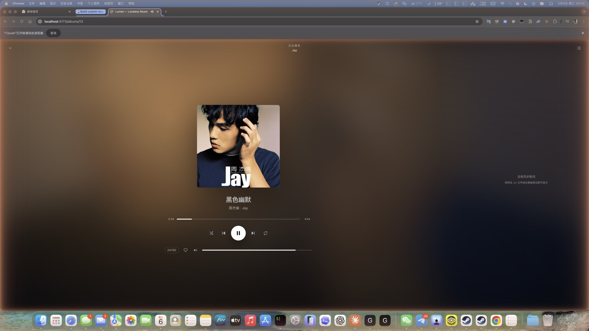
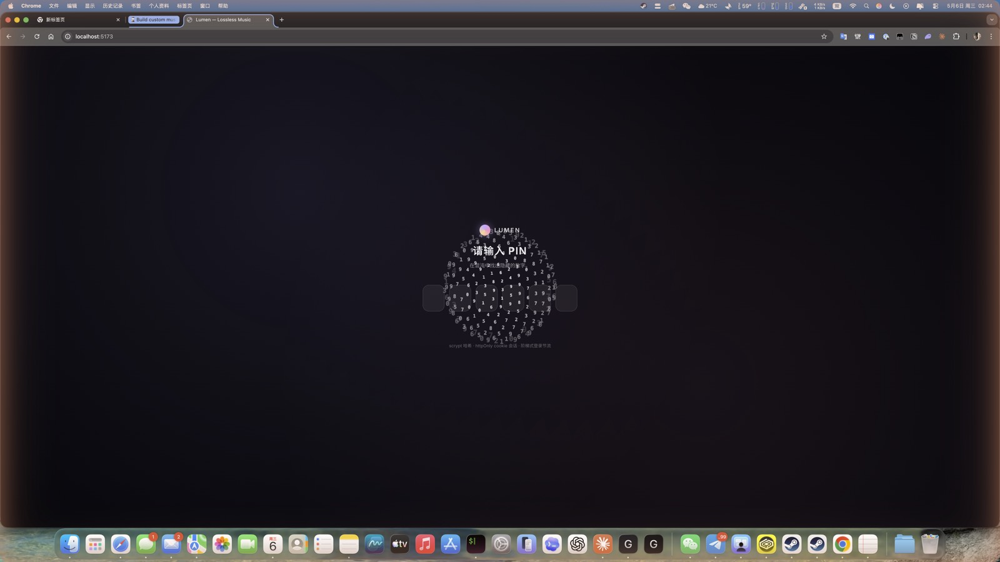
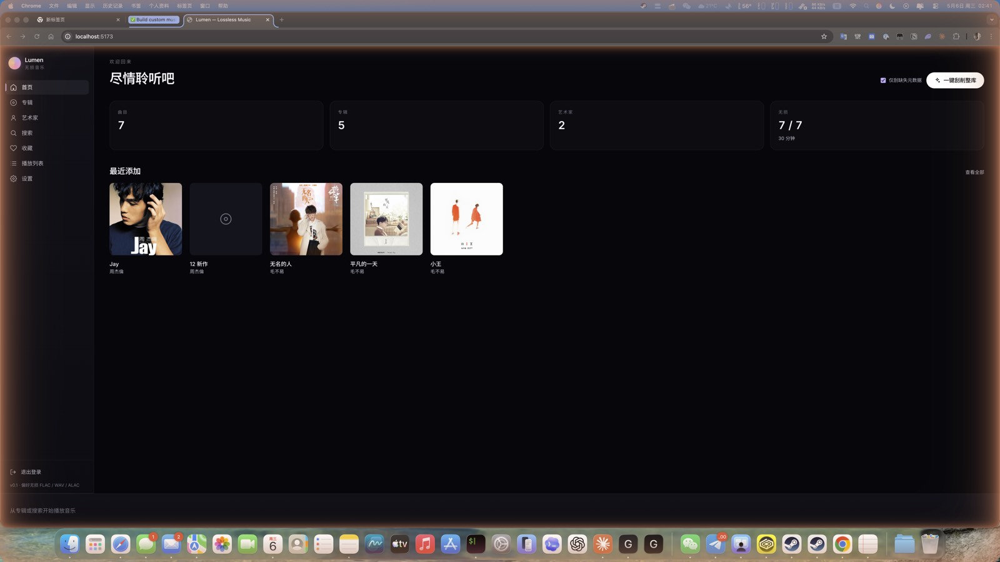
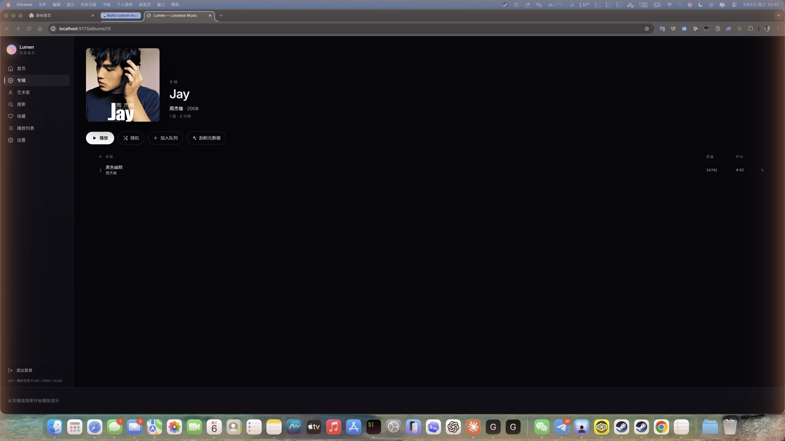

# Lumen Music

> 自托管的本地无损音乐流媒体服务。一个进程提供 API 与前端，浏览器播放，浏览器随处可达。

完整覆盖 **FLAC / ALAC / WAV / AIFF / DSF / DFF / APE / WavPack / MP3 / OGG / OPUS** 的浏览与流式播放。无需外部账号、无需 Docker，单二进制级别的部署体积（13 MB tar.gz）。



| | |
|:---:|:---:|
|  |  |
| 6 位 PIN 登录页 · 3D 数字粒子球背景 | 首页 · 一键刮削整库 · 最近添加 |
|  | |
| 专辑页 · 封面提取色调 · 刮削元数据 | |

---

## 功能

### 音乐库
- 递归扫描本地目录，**增量识别**（`mtime` 跳过未变文件，扫尾自动清理失踪条目）
- 用 [`music-metadata`](https://github.com/Borewit/music-metadata) 解析 ID3v2 / Vorbis / MP4 atoms / APEv2，UTF-8 优先
- **专辑去重**按 `(album_name, album_artist)` 配对而非 `(name, artist)` —— 同张专辑里出现不同曲目艺人时不会被拆成多张
- 多碟、年代、流派、码率、采样率、位深、声道、容器等全字段索引
- 一首歌的所有元数据在曲目页可见（含 `Hi-Res / 24/192` 标识）

### 元数据"刮削器"
- 三层数据源：**MusicBrainz**（国际权威）→ **NetEase 网易云**（type=10 album 搜索）→ **Kugou 酷狗**（CN 网络下原版补盲）
- MB 候选按 release-group 类型加权选 canonical 版本（Album > EP > Single，避开 Compilation/Live/Remix）
- 简繁汉字 1-字符差异容错（`周杰伦 ↔ 周杰倫` 自动识别为同一艺人）
- **三入口**：首页一键刮全库 / 专辑页单专辑刮 / 曲目级 ✨ 候选选择对话框
- 自动模式高度严格：仅 MB 高分匹配 + NetEase 同名同艺人才会自动应用，避免错配翻唱
- 1 r/s MB 限速合规 + 阶梯式重试

### 播放体验
- HTTP Range 流式播放，浏览器拖进度条秒到位
- **Web Audio AnalyserNode 真实频谱可视化**（fftSize=64，单实例 + rAF 直绘 DOM，资源消耗近乎零）
- 全屏 Now Playing：从专辑封面提取主色 → 双径向渐变 + 模糊大图背景，**真实**支持同步歌词（本地 `.lrc` 文件 / NetEase 严格匹配回退）
- 媒体键支持（macOS 触控栏 / OS 通知中心）
- 播放队列、随机、单曲循环、列表循环
- 音量、收藏、播放列表、搜索

### 安全
- 单密码访问保护（适合公网暴露），**httpOnly cookie session**（30 天）
- scrypt 哈希（N=16384, r=8, p=1，无外部依赖，纯 Node 内置 crypto）
- 阶梯式登录节流（错 1 次冷却 1s → 2 → 5 → 10 → 30 → 60s，登录成功清零）
- 首次访问自动进入「设置 PIN」页，6 位数字 OTP 风格输入
- 反爬美化：3D 数字粒子球背景，正确输入时数字粒子飞入对应输入框 + 验证对勾动画

### UI
- 暗色磨砂玻璃风（自研色板提取算法，无外部 dep）
- Framer Motion 页面过渡 + 微动效
- 响应式布局
- 键盘快捷键

---

## 技术栈

| 层 | 选型 |
|---|---|
| 后端 | Node.js 20+ · Fastify 5 · better-sqlite3 · music-metadata · @fastify/cookie |
| 前端 | React 19 · Vite 6 · TypeScript · Tailwind v4 · Framer Motion · Zustand · TanStack Query · React Router |
| 持久化 | SQLite (单文件) · WAL 模式 · 外键约束 |
| 鉴权 | scrypt + httpOnly cookie session |
| 包管理 | pnpm workspace |

源码总量 **~580 KB**（不含依赖），生产部署 bundle **54 MB / 13 MB gz**。

---

## 快速开始

### 开发模式

```bash
git clone https://github.com/wangyaominde/lumen-music.git
cd lumen-music
pnpm install
pnpm dev      # server: :4477  web: :5173
```

打开 http://localhost:5173 →
1. 设置 6 位 PIN（首次访问）
2. 设置 → 添加音乐目录 → 开始扫描
3. 首页 → ✨ 一键刮削整库（修补缺失元数据）

### CLI 直接扫描

```bash
pnpm scan /path/to/your/music
```

### 生产部署

```bash
pnpm package          # 输出到 ./release/，54 MB
pnpm package:tar      # 同上 + 打包 lumen-music.tar.gz (13 MB)
```

把 `release/` 整个目录拷到目标机器：

```bash
tar -xzf lumen-music.tar.gz -C /opt/lumen-music
cd /opt/lumen-music
./start.sh            # 监听 :4477
```

跨平台（如 macOS 编译 → Linux 部署），首次需要重建 SQLite 原生绑定：

```bash
cd server && npm rebuild better-sqlite3
```

详细部署文档（systemd、Caddy / Nginx 反代示例）在 `release/README.md`。

---

## 配置

通过环境变量：

| 变量 | 默认 | 说明 |
|---|---|---|
| `PORT` | `4477` | 监听端口 |
| `HOST` | `0.0.0.0` | 绑定地址 |
| `LUMEN_DATA_DIR` | `./data` | SQLite 数据库 + 封面图存放位置 |
| `NODE_ENV` | (unset) | `production` 时 cookie `Secure` 标志启用，HTTPS 反代后必设 |

---

## 数据位置

| 路径 | 内容 |
|---|---|
| `data/library.db` | 曲目 / 专辑 / 艺人 / 播放列表 / 收藏 / 鉴权哈希 / session |
| `data/covers/` | 提取或刮取的专辑封面（按 `sha1(album_name + album_artist)` 命名）|

仅 `data/` 需要持久化备份。丢了不会丢源文件，但要重新扫描 + 重设 PIN。

---

## 扫描准确性

| 策略 | 说明 |
|---|---|
| 增量 | 以 `mtime` 跳过未变文件 |
| 专辑去重 | `(album_name, album_artist)` 配对，避免同专辑因不同曲目艺人被分裂 |
| 优先 albumartist | 分组按 `albumartist` 标签，回退到 track artist |
| 路径推断 | 当 tag 缺失，从 `Artist/Album/Track.flac` 或 `Artist - Title.flac` 路径反推 |
| 封面提取 | 内嵌图 → 文件夹 `cover.jpg`/`folder.jpg`/`front.jpg`/`AlbumArt.jpg` |
| 扫尾清理 | 文件被删后下次扫描自动从索引移除 |

---

## 浏览器格式支持

| 格式 | 浏览器原生播放 | 流式传输 |
|---|---|---|
| FLAC | ✅ Chrome / Firefox / Edge / Safari 16+ | ✅ |
| ALAC (m4a) | ✅ Safari，部分 Chrome | ✅ |
| WAV / AIFF | ✅ 全部 | ✅ |
| MP3 / OGG / OPUS | ✅ 全部 | ✅ |
| APE / WavPack / DSF / DFF | ❌ | ⚠️ 原始字节流（需后续转码层）|

---

## 键盘快捷键

| 键 | 行为 |
|---|---|
| `Space` | 播放 / 暂停（在 Now Playing 页）|
| `←` / `→` | 上一首 / 下一首 |
| `Esc` | 收起 Now Playing |

---

## 安全注意事项

- **首次设置 PIN 后立刻访问**避免被路过陌生人抢先初始化
- **HTTPS 反代后必须设 `NODE_ENV=production`**，否则 cookie 不会带 `Secure` 标志
- session 在 SQLite 持久化，修改 `auth` 表的密码或清空 `sessions` 表会让所有设备强制重新登录
- 鉴权对所有 `/api/*` 全局生效（除 `/api/auth/*`），包括音频流和封面 —— 没有 cookie 拿不到任何内容

---

## 已知限制

- MB API 限速 1 r/s 是硬限制，整库刮削大库 (1k+ 曲目) 需要数分钟
- 部分艺人（如 Jay Chou）在 NetEase / Kugou 因版权下架，原版封面/歌词无源可拿，需手动放 `cover.jpg` 到专辑文件夹
- 浏览器无法原生播放 APE / DSD，目前直传字节流（计划加 ffmpeg 转码层）
- 仅支持单用户，无多账号 / ACL（个人自托管定位）

---

## 项目结构

```
.
├── server/                 # Node.js 后端
│   └── src/
│       ├── index.ts            # Fastify entry + auth gate
│       ├── auth.ts             # scrypt + sessions
│       ├── scanner.ts          # 文件扫描 + path heuristics
│       ├── enrich.ts           # MB / NetEase / Kugou scraper
│       ├── db.ts               # SQLite schema
│       └── routes/             # API 路由
├── web/                    # React 前端
│   └── src/
│       ├── pages/              # Home / Albums / Album / Artist / Search / Settings / Login ...
│       ├── components/         # PlayerBar / NowPlaying / EnrichDialog / EqBars ...
│       ├── store/              # Zustand stores (player / auth / ui)
│       ├── lib/                # color extraction / lrc parser / format
│       └── api/
└── scripts/
    └── package.mjs         # 生产构建打包脚本
```

---

## License

MIT — see [LICENSE](./LICENSE).

致谢：[music-metadata](https://github.com/Borewit/music-metadata)、[Fastify](https://fastify.dev)、[MusicBrainz](https://musicbrainz.org)。
